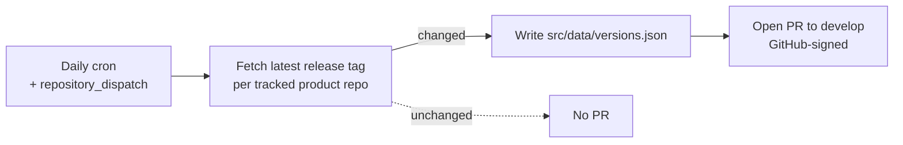

# glyndor.net

> The marketing and projects site for [Glyndor](https://glyndor.net) — secure, self-hosted, open-source infrastructure.

[](https://github.com/Glyndor/glyndor.net/actions/workflows/ci.yml)
[](https://github.com/Glyndor/glyndor.net/actions/workflows/version-bump.yml)

A static [Astro](https://astro.build) site: English and Spanish, zero client-side JavaScript islands, no runtime server.

## Quick start

Requires [Bun](https://bun.sh).

```sh
bun install
bun run dev      # http://localhost:15694
```

| Command         | Action                           |
| --------------- | --------------------------------- |
| `bun run dev`   | Start the dev server              |
| `bun run build` | Build the static site to `dist/`  |
| `bun run check` | Type-check Astro and TypeScript   |
| `bun run lint`  | Lint and format-check with Biome  |

## i18n

Add a string to `src/lib/i18n/en` (the source of truth), then mirror it in `src/lib/i18n/es`. The `es` dictionary is typed against `en`, so a missing key is a type error.

## Local preview under Podman

```sh
bun run build
podman compose up        # http://127.0.0.1:8080
```

Serves the built `dist/` with Caddy, bound to localhost only.

## How versions stay current



A workflow here (`.github/workflows/version-bump.yml`) keeps the displayed
product versions honest: it reads each tracked repository's latest GitHub
release daily, on demand, or the instant a product's own release workflow
fires a `repository_dispatch`. A changed tag opens a PR against
`src/data/versions.json`, reviewed like any other change — there is no
network call at build time, so the built site stays reproducible.

## License

[MIT](./LICENSE).
